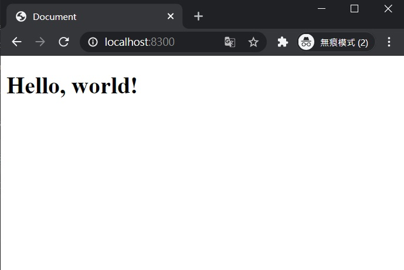

因為本機跑 CRA 執行太過龜速，結果一腳踏入了webpack坑，發現這坑實在太深了，只能一步步筆記下來，不然改天就忘了自己到底做過什麼...

<!--truncate-->

第一次見到Webpack簡直像看到一種無法理解的生物，但想想不論是哪種語言，最初不也都是這樣走來的嗎？

決定要學的東西，撩下去給它學就是了。<br/><br/>

> 『無知才會引起毀滅，知識不會。』──電影《露西Lucy》

<!--truncate-->

<hr/>

## 前置&說明
**文章內容包含：**
- 如何用 Webpack5 架構出 react 開發環境

**不包含：**
- 如何使用 React
- React 相關語法說明

**環境：**
- Visual Stusio Code v1.51.1
- Node.js v12.16.2
- npm v6.14.4

<br/>

準備好了的話，旅程開始！<br/>
（本文請同時搭配 <a href="../../../2020/12/01/Webpack-note/" target="_blank">Webpack 筆記</a> 服用）

<br/>

## 執行步驟
1. 用 Visual Stusio Code 開啟一個空的新專案資料夾，terminal 執行 `npm init` 產出 package.json 檔案
> `npm init -y` 可以跳過設定，直接使用預設值喔

<br/>

2. 執行`npm install webpack webpack-cli webpack-dev-server --save-dev`，安裝 webpack 相關套件

<br/>

3. 安裝 babel
  `npm install babel-loader @babel/core @babel/preset-react @babel/preset-env --save-dev`

<br/>

4. 安裝`npm install html-webpack-plugin　clean-webpack-plugin --save-dev`，掛上編譯輔助套件

（2~4 除套件名稱外其餘參數皆相同，可以全部一次安裝）

<br/>

5. 在根目錄新增 webpack.config.js 檔案，內容如下：
```
const path = require('path');
const HtmlWebpackPlugin = require('html-webpack-plugin')
const { CleanWebpackPlugin } = require('clean-webpack-plugin')

module.exports = () => {
    return {
        entry: {
            main: path.resolve(__dirname, './src/App.jsx')
        },
        output: {
            path: path.resolve(__dirname, './build'),
            filename: 'js/[name].bundle.js',
        },
        module:{
            rules:[
                {
                    test: /.jsx$/,
                    exclude: /node_modules/,
                    use: {
                        loader: "babel-loader",
                        options: {
                            presets: [
                                "@babel/preset-react",
                                // "@babel/preset-env"
                            ]
                        }
                    }
                },
                {
                    test: /.js$/,
                    exclude: /node_modules/,
                    use: {
                        loader: "babel-loader",
                        options: {
                            presets: [
                                "@babel/preset-react",
                                // "@babel/preset-env"
                            ]
                        }
                    }
                },
            ]
        },
        plugins: [
            new HtmlWebpackPlugin({
                title: 'Document111',
                template: './src/index.html',
                filename: 'index.html',
            }),
            new CleanWebpackPlugin(),
        ],
        devServer:{
            open: true,
            port: 8300,
            inline:true,
        }
    }
};
```

落落長一大串啊......這大概就是 CRA 會誕生的原因了吧。

因為內容太多也太雜，各項設定具體說明請參考 <a href="../../../2020/12/01/Webpack-note/" target="_blank">Webpack 筆記</a>，這裡就不花版面一一解釋（說好的 10 分鐘！）。

到這裡為止環境備妥，可以使用 react 了！

<br/>

6. 安裝 React（示範用，只載入最基本的功能）
	`npm install react react-dom`
	
	> 程式規模不大的話可以改成在 index.html（見下一步驟）引入 CDN，這部分請見 React 官網使用說明

<br/>

7. 依照  webpack.config.js 裡面的設定，在根目錄底下新增 `src` 資料夾，放入 `index.html` 和 `App.jsx` 兩個檔案

【index.html】
```
<!DOCTYPE html>
<html lang="zh-TW">

<head>
    <meta charset="UTF-8">
    <meta name="viewport" content="width=device-width, initial-scale=1.0">
    <title>Document</title>
</head>

<body>
    <div id="root"></div>
</body>

</html>
```

【App.jsx】
```react
import React from 'react';
import ReactDOM from 'react-dom';

let element = <h1>Hello, world!</h1>

ReactDOM.render(
    element,
    document.getElementById('root')
);
```

<br/>

8. 環境準備完畢，資料夾結構如下：

node_modules<br/>
　|<br/>
src ──┐<br/>
　|　　App.jsx<br/>
　|　　index.html<br/>
package-lock.json<br/>
　|<br/>
package.json<br/>
　|<br/>
webpack.config.js<br/>

<br/>

9. `package.json` 加入指令
```json
"scripts": {
	"dev": "webpack serve --config webpack.config.js --mode development --watch",
	"build": "webpack",
	...
},
```

> webpack5 不支援 `webpack-dev-server` 這個指令了，執行 webpack-dev-server 的 command 要改為 `webpack serve`。

<br/>

10. terminal 執行 `npm run dev`運行網站


<br/>

完成！


前端新手，如有任何錯誤敬請指正m(_ _)m

<hr/>

## 參考資料
[**・webpack教程：如何從頭開始設置 webpack 5**（主要參考文章）](https://segmentfault.com/a/1190000037554402)<br/>
[・[ReactJS] 使用Webpack, npm建置React開發環境](http://www.jysblog.com/coding/web/js-%E4%BD%BF%E7%94%A8webpack-npm%E5%BB%BA%E7%BD%AEreact%E9%96%8B%E7%99%BC%E7%92%B0%E5%A2%83/)<br/>
[・逐步建置React + Webpack開發環境](https://medium.com/@savemuse/react-%E9%80%90%E6%AD%A5%E5%BB%BA%E7%BD%AEreact-webpack%E9%96%8B%E7%99%BC%E7%92%B0%E5%A2%83-717fd56aab27)
